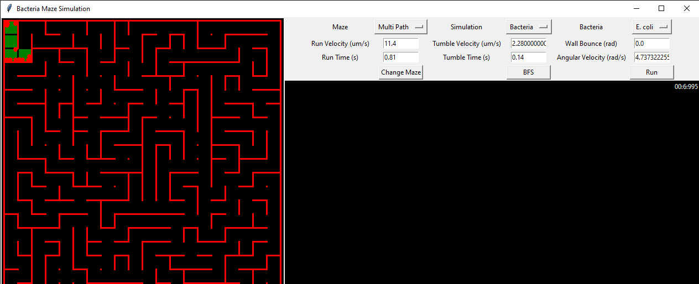

# BacteriaMotion
Gui simulating bacterial motion solving mazes compared to standard algorithms.

# Motivation
The ability of an organism to solve a maze is a non-trivial way to evaluate organismal intelligence. In fact, this method has been used to evaluate and compare the intelligence of humans, monkeys, other mammals, and more. One of the areas that is currently less explored is the intelligence of bacteria in a maze-solving context; however, due to advancements in microfluidics, it now poses as an interesting way to better study their space searching and partitioning algorithms. By studying how bacteria move through a maze and explore paths, it will allow us to create search algorithms inspired by their methods for use in a variety of applications. 

# Installation

### Requirements:
1. [Python 3](https://www.python.org/downloads/) 
2. Make sure python is in the PATH variable

### Setup
1. If you have git in a directory: `git clone https://github.com/dragonmushu/BacteriaMotion.git`  
2. If you don't have git, download zip from `Clone or download` on top right
    3. Extract the folder
3. Navigate to `src` directory on a terminal
4. Run `python gui.py`

# Features

## Maze Options
    1. Singlepath: the default maze generated, can persist for multiple simulations
    2. Multipath: knocks down walls of a single path math to generate the maze

## Simulation Options
    1. Bacteria: The following parameters are required to run the bacterial simulation
        i) Run Velocity (um/s)
        ii Tumble Velocity (um/s)
        iii) Tumble Angular Velocity (rad/s)
        iv) Run Time (s)
        v) Tumble Time (s) 
        vi) Bacteria type
            - input (the user enters in values for the parameters listed above)
            - e.coli (the simulator uses values obtained from literature to serialize the parameters)
    2. Random Walk
    3. Left wall follow
    4. Right wall follow
    
## BFS
    1. this feature allows the user to see the shortest path distance for the solved maze

## Statistics Panel
    1. Total time (s)
    2. Number of cells explored (cells)
    3. Percent Exploration (%)
    4. Route Distance (cells)

# Future Features

- [ ] Swap GUI library to PyQt
- [ ] Use physics library for collision handling
- [ ] Separate collision logic
- [ ] Wall interactions (elastic / inelastic collisions)
- [ ] Increase statistical information
- [ ] Different environments (media-poor)
- [ ] Energy and energy-loss functions
- [ ] Optimization algorithms: Monte Carlo, Gradient Descent
- [ ] Create M. marinus parameters and extend known bacteria
- [ ] Motion uncertainties

